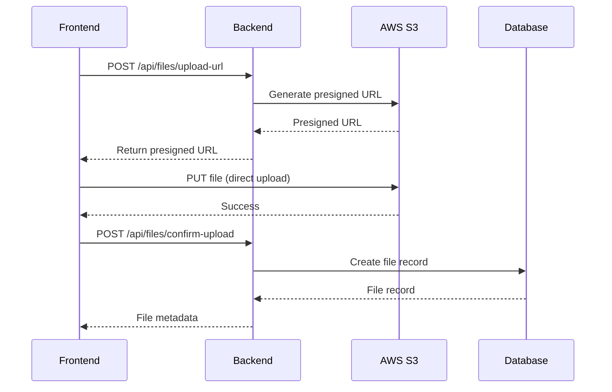
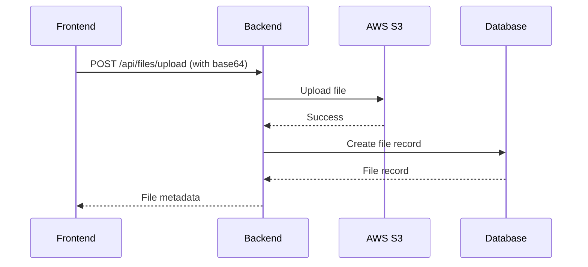

# File Upload with AWS S3

This document provides an overview of the file upload functionality integrated with AWS S3.

## Overview

The file upload system allows users to upload files to AWS S3 and manage them through the backend API. Files are tracked in the database and can be linked to library items.

**Key Features:**
- ✅ AWS S3 integration for file storage
- ✅ Presigned URLs for direct frontend uploads
- ✅ Direct upload through backend (base64)
- ✅ File metadata tracking
- ✅ User-owned file access control
- ✅ Download URL generation
- ✅ File deletion with S3 cleanup

---

## Architecture

### File Storage Flow

```
┌─────────────┐
│  Frontend   │
└──────┬──────┘
       │
       │ 1. Generate file path
       │
       ├─────────────────────┐
       │                     │
       ▼                     ▼
┌─────────────┐      ┌─────────────┐
│   Backend   │      │   AWS S3    │
│   (API)     │      │  (Storage)  │
└──────┬──────┘      └─────────────┘
       │
       ▼
┌─────────────┐
│  PostgreSQL │
│  (Metadata) │
└─────────────┘
```

### Upload Methods

#### Method 1: Presigned URL Upload (Recommended)



**Advantages:**
- No backend bottleneck
- Better for large files
- Reduced server load
- Faster upload speeds
- Cost-effective

#### Method 2: Direct Upload



**Use Cases:**
- Small files (< 1MB)
- Server-side processing needed
- Simpler frontend implementation

---

## File Path Management

**Important:** File paths are generated on the **frontend** to allow flexible organization.

### Recommended Path Patterns

```javascript
// User profile files
users/{userId}/profile/{filename}
users/{userId}/avatar/{timestamp}-{filename}

// Library item files
libraries/{libraryId}/items/{itemId}/{filename}
libraries/{libraryId}/items/{itemId}/images/{filename}

// Date-based organization
uploads/{year}/{month}/{day}/{uuid}-{filename}

// Type-based organization
images/{userId}/{timestamp}-{filename}
documents/{userId}/{timestamp}-{filename}
```

### Path Generation Helper

```javascript
export function generateFilePath(userId, file) {
  const timestamp = Date.now();
  const sanitizedName = file.name.replace(/[^a-zA-Z0-9.-]/g, '_');
  return `users/${userId}/uploads/${timestamp}-${sanitizedName}`;
}
```

---

## Database Schema

### UserFile Model

```prisma
model UserFile {
  id        Int      @id @default(autoincrement())
  userId    Int
  user      User     @relation(fields: [userId], references: [id], onDelete: Cascade)
  fileUrl   String   // S3 path/key
  fileName  String
  fileType  String   // MIME type
  fileSize  Int      // bytes
  createdAt DateTime @default(now())
  updatedAt DateTime @updatedAt
  libraryItems LibraryItem[] @relation("LibraryItemFiles")
}
```

**Fields:**
- `fileUrl`: The S3 path/key (e.g., `users/123/uploads/1234567890-file.pdf`)
- `fileName`: Original filename
- `fileType`: MIME type (e.g., `image/jpeg`, `application/pdf`)
- `fileSize`: Size in bytes

---

## API Endpoints

### 1. Get Presigned Upload URL
```
POST /api/files/upload-url
```
Request a presigned URL for direct S3 upload.

### 2. Confirm Upload
```
POST /api/files/confirm-upload
```
Confirm file uploaded and create database record.

### 3. Direct Upload
```
POST /api/files/upload
```
Upload file through backend with base64 content.

### 4. List Files
```
GET /api/files?limit=50&offset=0
```
Get paginated list of user's files.

### 5. Get File Details
```
GET /api/files/:fileId
```
Get metadata for a specific file.

### 6. Get Download URL
```
GET /api/files/:fileId/download-url
```
Get presigned URL for downloading.

### 7. Delete File
```
DELETE /api/files/:fileId
```
Delete file from S3 and database.

See [docs/FILES_API.md](docs/FILES_API.md) for detailed documentation.

---

## Environment Configuration

### Required Environment Variables

```env
# AWS S3 Configuration
AWS_REGION=us-east-1
AWS_ACCESS_KEY_ID=your-access-key-id
AWS_SECRET_ACCESS_KEY=your-secret-access-key
AWS_S3_BUCKET=your-bucket-name
```

### AWS Setup Checklist

- [ ] Create S3 bucket
- [ ] Configure bucket permissions
- [ ] Set up CORS policy
- [ ] Create IAM user
- [ ] Generate access keys
- [ ] Configure bucket policy (if needed)
- [ ] Add credentials to `.env`

See [ENV_SETUP.md](ENV_SETUP.md) for detailed setup instructions.

---

## Frontend Integration

### Configuration

```javascript
// config/s3.config.js
export const S3_CONFIG = {
  bucket: process.env.REACT_APP_S3_BUCKET,
  region: process.env.REACT_APP_S3_REGION,
  baseUrl: `https://${process.env.REACT_APP_S3_BUCKET}.s3.${process.env.REACT_APP_S3_REGION}.amazonaws.com`
};

export function getFileUrl(filePath) {
  return `${S3_CONFIG.baseUrl}/${filePath}`;
}
```

### Quick Example: Presigned URL Upload

```javascript
// 1. Request presigned URL
const response = await fetch('/api/files/upload-url', {
  method: 'POST',
  headers: {
    'Authorization': `Bearer ${token}`,
    'Content-Type': 'application/json'
  },
  body: JSON.stringify({
    fileName: file.name,
    fileType: file.type,
    fileSize: file.size,
    filePath: `users/${userId}/uploads/${Date.now()}-${file.name}`
  })
});

const { uploadUrl, filePath } = await response.json();

// 2. Upload to S3
await fetch(uploadUrl, {
  method: 'PUT',
  body: file,
  headers: { 'Content-Type': file.type }
});

// 3. Confirm upload
await fetch('/api/files/confirm-upload', {
  method: 'POST',
  headers: {
    'Authorization': `Bearer ${token}`,
    'Content-Type': 'application/json'
  },
  body: JSON.stringify({
    fileName: file.name,
    fileType: file.type,
    fileSize: file.size,
    filePath: filePath
  })
});
```

See [docs/FILES_API_EXAMPLES.md](docs/FILES_API_EXAMPLES.md) for comprehensive examples.

---

## Security Best Practices

### Backend Security

1. **Authentication**: All endpoints require JWT authentication
2. **Access Control**: Users can only access their own files
3. **File Validation**: Validate file types and sizes
4. **Presigned URL Expiration**: URLs expire after 1 hour
5. **S3 Bucket Policies**: Restrict access appropriately

### Frontend Security

1. **File Type Validation**: Check file types before upload
2. **File Size Limits**: Enforce reasonable size limits
3. **Filename Sanitization**: Remove special characters
4. **HTTPS Only**: Never upload over HTTP in production
5. **Error Handling**: Don't expose sensitive information

### S3 Security

1. **IAM Policies**: Use least privilege principle
2. **Bucket Policies**: Configure appropriate access rules
3. **CORS Configuration**: Only allow trusted origins
4. **Encryption**: Enable server-side encryption
5. **Versioning**: Enable versioning for recovery

---

## S3 CORS Configuration

Add this CORS policy to your S3 bucket:

```json
[
  {
    "AllowedHeaders": ["*"],
    "AllowedMethods": ["GET", "PUT", "POST", "DELETE"],
    "AllowedOrigins": ["http://localhost:3000", "https://yourdomain.com"],
    "ExposeHeaders": ["ETag"]
  }
]
```

---

## File Size Recommendations

### Presigned URL Method
- **Recommended**: Files > 1MB
- **Maximum**: Limited by S3 (5TB per object)
- **Optimal**: 1MB - 5GB

### Direct Upload Method
- **Recommended**: Files < 1MB
- **Maximum**: ~10MB (base64 overhead)
- **Optimal**: < 500KB

### General Guidelines
- Images: < 5MB
- Documents: < 10MB
- Videos: Use presigned URLs
- Large files: Consider multipart upload

---

## Linking Files to Library Items

Files can be associated with library items through the many-to-many relation:

```typescript
// Create library item with files
await prisma.libraryItem.create({
  data: {
    // ... item data
    userFiles: {
      connect: [
        { id: fileId1 },
        { id: fileId2 }
      ]
    }
  }
});

// Add files to existing item
await prisma.libraryItem.update({
  where: { id: itemId },
  data: {
    userFiles: {
      connect: { id: fileId }
    }
  }
});
```

---

## Cost Considerations

### S3 Storage Costs
- Standard storage: ~$0.023 per GB/month
- Free tier: 5GB for 12 months

### Data Transfer
- Upload (PUT): Free
- Download (GET): First 100GB free/month
- Additional: ~$0.09 per GB

### Requests
- PUT requests: ~$0.005 per 1,000
- GET requests: ~$0.0004 per 1,000

**Cost Optimization:**
- Use presigned URLs to minimize backend costs
- Implement file size limits
- Clean up unused files
- Use lifecycle policies for old files

---

## Monitoring and Logging

### Backend Logging

All file operations are logged:
- Upload attempts
- Download requests
- Deletion operations
- Error conditions

### S3 Access Logs

Enable S3 server access logging:
```bash
aws s3api put-bucket-logging \
  --bucket your-bucket \
  --bucket-logging-status file://logging.json
```

---

## Testing

### Test Presigned URL Upload

```bash
# 1. Get upload URL
curl -X POST http://localhost:3000/api/files/upload-url \
  -H "Authorization: Bearer $TOKEN" \
  -H "Content-Type: application/json" \
  -d '{
    "fileName": "test.txt",
    "fileType": "text/plain",
    "fileSize": 100,
    "filePath": "users/1/test/test.txt"
  }'

# 2. Upload to S3 (use returned uploadUrl)
curl -X PUT "$UPLOAD_URL" \
  -H "Content-Type: text/plain" \
  --data "test content"

# 3. Confirm upload
curl -X POST http://localhost:3000/api/files/confirm-upload \
  -H "Authorization: Bearer $TOKEN" \
  -H "Content-Type: application/json" \
  -d '{
    "fileName": "test.txt",
    "fileType": "text/plain",
    "fileSize": 100,
    "filePath": "users/1/test/test.txt"
  }'
```

---

## Troubleshooting

### Common Issues

**Upload fails with 403 Forbidden**
- Check IAM user permissions
- Verify S3 bucket policy
- Ensure CORS is configured

**Presigned URL expired**
- URLs are valid for 1 hour
- Request new URL if expired
- Adjust expiration time if needed

**File not found in S3**
- Verify file was actually uploaded
- Check file path matches exactly
- Ensure bucket name is correct

**CORS errors**
- Verify CORS policy in S3
- Check allowed origins
- Ensure correct HTTP methods

---

## Next Steps

- [ ] Implement image thumbnails
- [ ] Add file type restrictions
- [ ] Implement virus scanning
- [ ] Add bulk upload
- [ ] Implement progress tracking
- [ ] Add file preview
- [ ] Implement file versioning
- [ ] Add file sharing between users

---

## Additional Resources

- [AWS S3 Documentation](https://docs.aws.amazon.com/s3/)
- [Presigned URLs Guide](https://docs.aws.amazon.com/AmazonS3/latest/userguide/PresignedUrlUploadObject.html)
- [S3 Security Best Practices](https://docs.aws.amazon.com/AmazonS3/latest/userguide/security-best-practices.html)
- [Files API Documentation](docs/FILES_API.md)
- [Files API Examples](docs/FILES_API_EXAMPLES.md)
- [Environment Setup](ENV_SETUP.md)

---

## Support

For issues or questions:
1. Check the documentation
2. Review error logs
3. Verify AWS credentials
4. Check S3 bucket configuration
5. Review CORS policy

